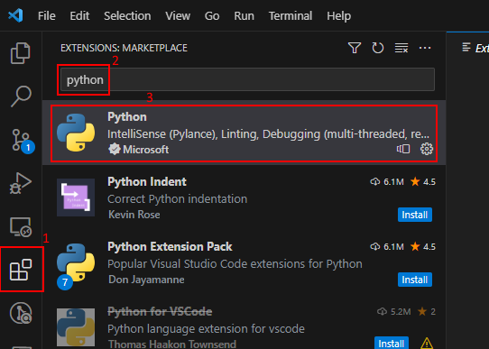

# VSCode Installation (Linux)

* Start by downloading Visual Studio code from [its official website](https://code.visualstudio.com/).
* Launch it.
* In the sidebar, open the extensions tab (icon with four little squares).
* Enter "Python" in the search box and install the Python extension (by Microsoft).

| Screenshot |
| :--------: |
|  |

## Next Step

[Install Git](git.md).
