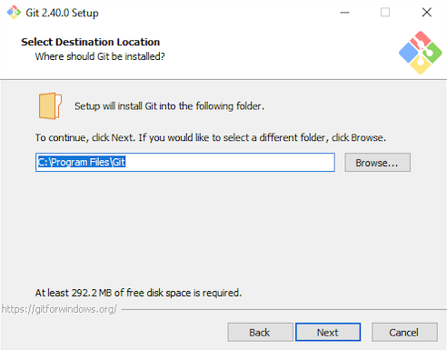
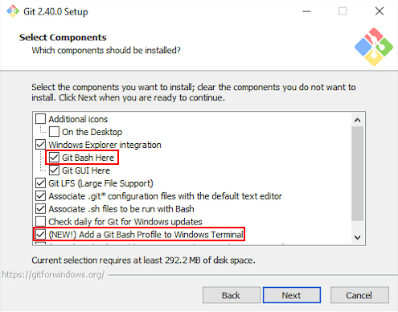
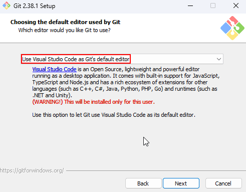

# Git Installation (Windows)

> **Important** Make sure you have Visual Studio Code installed before you install Git!

Downloading Git from the [official website](https://git-scm.com/download).
Next, launch the installation.

The installation setup consists of relatively many steps.
Below we highlight a few steps.
Not all of the installation steps are shown below: *if not shown below, you should simply accept the defaults*.

## Installation Path

| Installation Path Screen |
| :----------------------: |
|  |

We strongly advise you to install Git in the default location.
It is **not** a good idea (as some have done before) to install it in a OneDrive directory.

## Components

| Components Screen |
| :----------------------: |
|  |

Make sure Git Bash Here is checked.

## Default Editor

| Default Editor Screen |
| :----------------------: |
|  |

If Visual Studio Code is not listed, you should cancel the installation of Git and install Visual Studio Code first.


{{ my_include | markdownify }}

## Next Step

[Download the exercises](./github-classroom.md).
