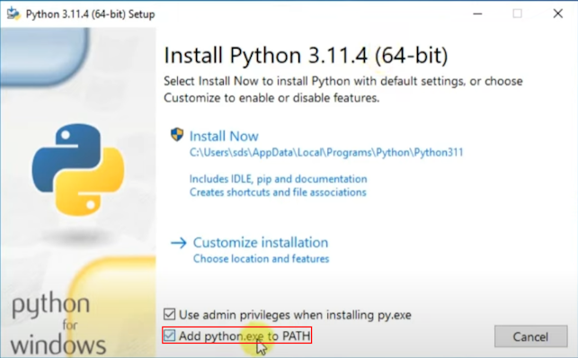

# Python Installation (Windows)

Python can be found [on the Python website](https://www.python.org/downloads/).
Download version 3.11 (don't pick a more recent version!) and install it.

> While installing, **check the checkbox to Add Python to PATH**.

| Add python.exe to PATH |
| :----------------------: |
|  |

## Checking Your Python Installation

Open a shell in the `scripts` directory inside the repository and enter:

```bash
# Runs the check-python-installation.py script
$ py check-python-installation.py
```

If the output ends on `SUCCESS`, you can proceed with the [next step](packages.md).

## Next Step

[Install Python packages](packages.md).
