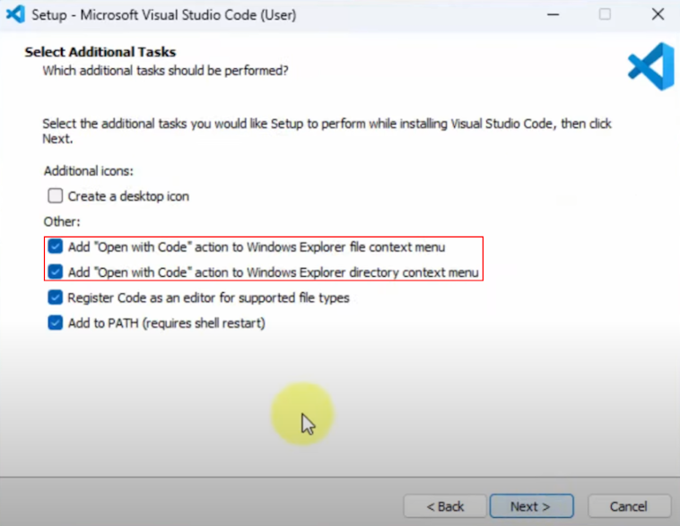

# VSCode Installation (Windows)

Start by downloading Visual Studio code from [its official website](https://code.visualstudio.com/).

> During the installation, make sure to select both "Open with Code" options.

| Select "Open with Code" Actions |
| :--------: |
|  |

* Launch Visual Studio Code.
* In the sidebar, open the extensions tab (icon with four little squares).
* Enter "Python" in the search box and install the Python extension (by Microsoft).

| Extension Tab |
| :--------: |
|  |

## Next Step

[Install Git](git.md).
