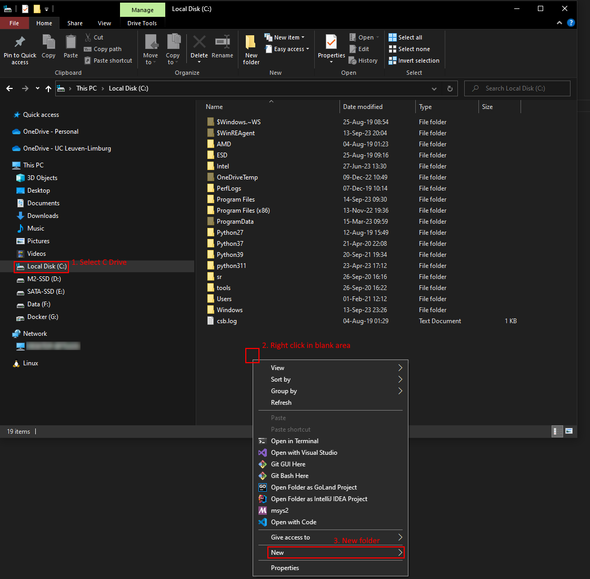

* Table of Contents
{:toc}

## Windows

* Open File Explorer, e.g., by pressing <kbd>Win</kbd> + <kbd>E</kbd>.
* Using the left pane, go to a location where you want to store all school-related material.
  If you're out of inspiration, feel free to go to This PC -> C Drive.
* In the right pane, right click on a blank area (below all files and directories).
* The context menu that appears can be slightly different on your OS.
* Select New -> Folder.
* Enter the name of the new directory, for example `programming`.

| Directory Creation |
| :----------------------: |
|  |

## MacOS

You can create a directory in many ways and in many locations.
These instructions will use the shell to create the folder named in your home directory.

* Press <kbd>Command</kbd> + <kbd>Space</kbd> and type `terminal`.
* Select Terminal.
* Type `cd` followed by enter.
  This ensures you end up in your home directory.
* Type `mkdir programming`.
  This creates a directory named `programming`.

You can enter this directory using `cd programming`.
