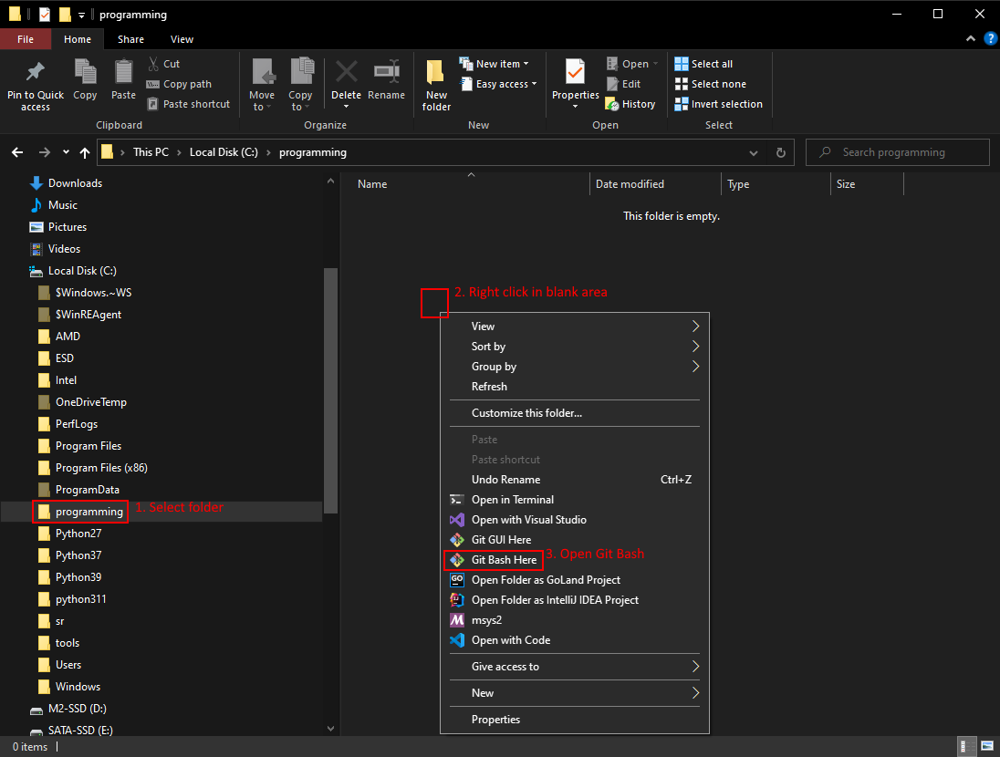

# Opening a Shell

* Table of Contents
{:toc}

## Windows

* Open File Explorer, e.g., by pressing <kbd>Win</kbd> + <kbd>E</kbd>.
* Using the left pane, navigate to the directory you wish to open a shell in.
* In the right pane, right click somewhere in the blank area below all directories and files.
* In the context menu that appears, pick Open Git Bash.
  On Windows 11, you may have to ask to Show More Options.

| Opening a Shell |
| :----------------------: |
|  |

## MacOS

* Open a Finder window and navigate to the folder.
* If you can’t see the path bar at the bottom of the Finder window, choose View > Show Path Bar.
* Control-click the folder in the path bar, then choose Open in Terminal.
