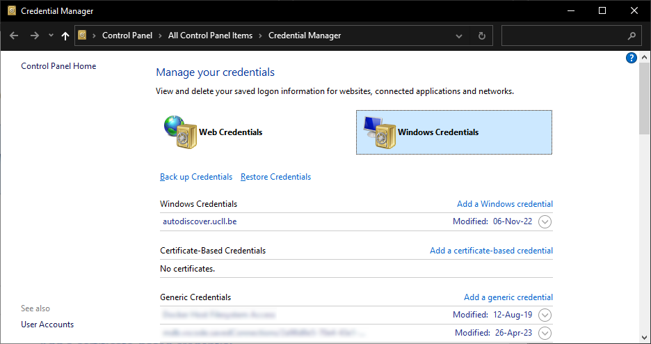

# Resetting Your GitHub Credentials

## Windows

Open the Start Menu and type

* English version: `creden` and select Credential Manager.
* Dutch version: `referen` and select Referentiebeheer.

| Credential Manager |
| :----------------------: |
|  |

Select Windows Credentials and look for an entry related to GitHub.
Remove it.

## MacOS/Linux

This scenario typically does not occur on these OSses as the GitHub login process requires you to explicitly enter your username.
