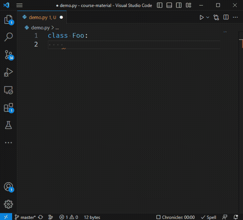

# Code snippets

Code snippets allow you to quickly generate code using autocomplete.
We show an example of it in action below:

| Code Snippet in Action |
| :-: |
|  |


Your cursor can automatically be positioned before the opening parenthesis so that you can immediately input the property's name.

## Creating a Snippet

* First, find the root directory of your repository.
  You can recognize it through the fact it contains a `.git` subdirectory.
  Depending on your system settings it might not be visible because it's a hidden folder.
* Inside this root directory, create a subdirectory `.vscode` if it doesn't already exist.
* Inside `.vscode`, create a file with extension `.code-snippets`, for example, `my-snippets.code-snippets`.

This file will contain information about snippets in [JSON format](https://en.wikipedia.org/wiki/JSON).
It looks like this:

```json
{
    "Name of the snippet": {
        "prefix": "prefix",
        "body": [
            "line 1",
            "line 2",
            "line 3",
            "...",
        ],
        "description": "Description",
        "scope": "python"
    }
}
```

* `prefix` is the string you need to type in to activate the snippet.
* `Name of the snippet` will appear in the autocomplete popup when you press CTRL+SPACE.
* `body` should be a list of lines to be inserted when you activate the snippet.
* `description` appears in the Command Palette, which is an alternative way to activate snippets.
  Press F1, enter `Snippet` and pick `Snippets: Insert Snippet` from the list.
  Here you'll see a list of all available code snippets with their description.
* `scope` indicates in which type of files the code snippet should be available.
  For example, if you put `html` here, the snippet will only be available when you edit HTML files.

## Example

The code snippets used in the demo above were defined as shown here:

```json
{
    "Readonly Property": {
        "prefix": "prop",
        "body": [
            "@property",
            "def $1(self):",
            "    return self.__$1",
        ],
        "description": "Description",
        "scope": "python"
    },
    "Read/Write Property": {
        "prefix": "propw",
        "body": [
            "@property",
            "def $1(self):",
            "    return self.__$1",
            "",
            "@$1.setter",
            "def $1(self, value):",
            "    self.__$1 = value"
        ],
        "description": "Description",
        "scope": "python"
    }
}
```

## More Information

Read more about how to define code snippets [here](https://code.visualstudio.com/docs/editor/userdefinedsnippets).
