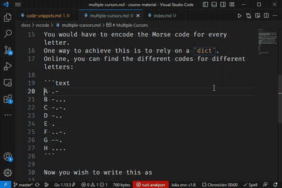

# Multiple Cursors

The cursor is the little symbol that indicates where keyboard input will be inserted.
You're encountered it many times as all applications involving the keyboard rely on it.

Visual Studio Code allows you to have multiple cursors at once.
Every key press will affect each cursor simultaneously.
This comes in handy more often than you'd think.

Say, for example, you are developing a Morse code translator.
You would have to encode the Morse code for every letter.
One way to achieve this is to rely on a `dict`.
Online, you can find the different codes for different letters:

```text
A .-
B -...
C -.-.
D -..
E .
F ..-.
G --.
H ....
```

Now you wish to write this as

```text
{
    'A': '.-',
    'B': '-...',
    'C': '-.-.',
    'D': '-..',
    'E': '.',
    'F': '..-.',
    'G': '--.',
    'H': '....',
}
```

Here's how we did it while writing this document:

| Multiple Cursors in Action |
| :-: |
|  |

## Working with Multiple Cursors

* The simplest way to add extra cursors is to ALT+click on the location you wish a new cursor to appear.
* To add a new cursor just above or below the current cursor, press ALT+&uarr; or ALT+&darr;, respectively.
* While having a piece of text selected, CTRL+D will look for the next occurrence of that piece of text and place an extra cursor there.
  For example, if you need to make a change to all `class`es in a file, select `class` and press CTRL+D until all instances of `class` have received an extra cursor.
* In order to get rid of all the extra cursors, you can press ESC.

Note that each cursor has its own clipboard.
