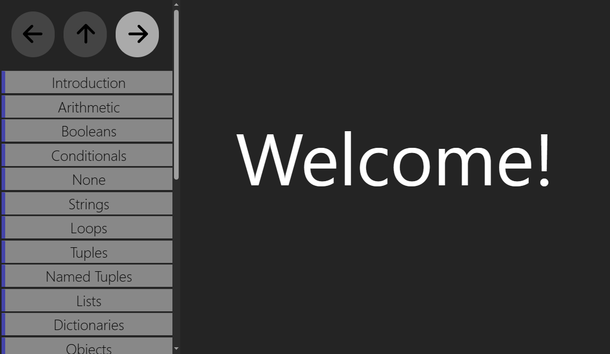
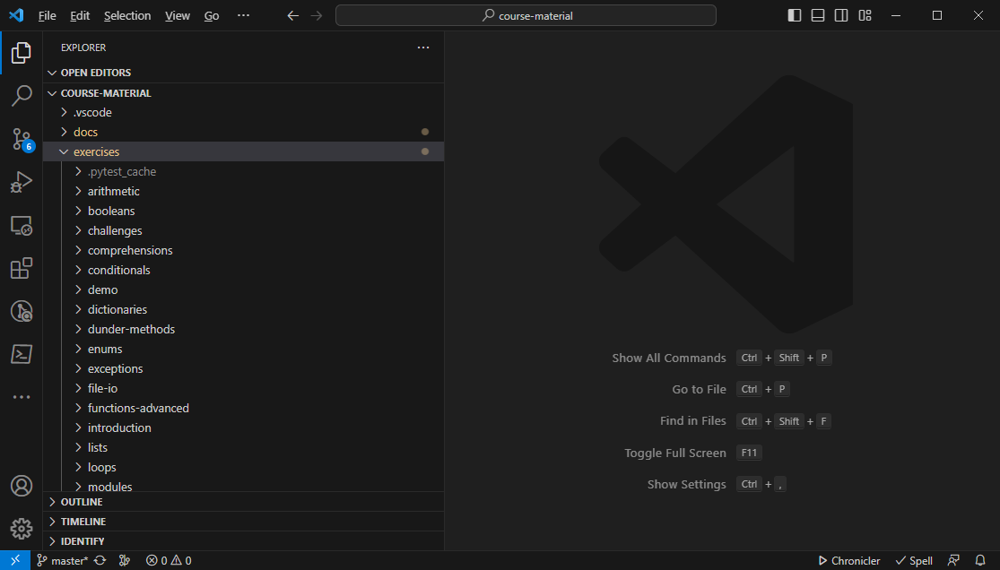
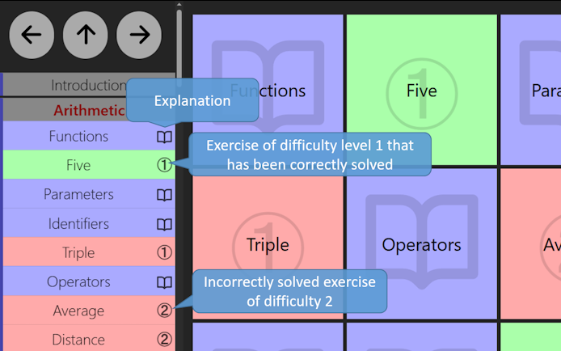

# Workflow

## Starting up the Server

First, start up the local server.

```bash
$ progtool server
 * Serving Flask app 'progtool.server'
 * Debug mode: off
[09/04/23 10:29:59] INFO     INFO:werkzeug:[31m[1mWARNING: This is a development server. Do not use it in a production            _internal.py:187
                             deployment. Use a production WSGI server instead.[0m
                              * Running on http://127.0.0.1:5000
                    INFO     INFO:werkzeug:[33mPress CTRL+C to quit[0m                                                            _internal.py:187
```

Using a web browser, go to `http://127.0.0.1:5000`.
This screen should appear:

| Welcome Screen |
| :------------: |
|  |

## Visual Studio Code

* Open Visual Studio Code.
* In the File menu, pick `Open Folder`.
* Select the folder where you have downloaded the course material.
* Open the exercises folder.

This is what you should see:

| Visual Studio Code |
| :------------: |
|  |

> On Windows, we would advise you to *pin* this folder.
> After having opened the folder, right click on the Visual Studio Code button in the taskbar.
> In the context menu that appeared, press the little pin next to the course material's directory.
> From now on, if you need to re-open the same folder, you can simply right-click the Visual Studio Code icon and select the directory.

## Going Through the Material

In your browser, you can view the course material.
The course material is divided up into chapters, each containing a series of explanation pages and exercises.

* Explanation pages have a little book icon.
* An exercise is identified by a circled number.
  The number gives you an idea of how difficult an exercise is.

| Course Material |
| :------------: |
|  |

### Solving an Exercise

Exercises typically expect you to write some code, more specifically a *function* with some specific name, say `foo`.
In order to solve the exercise:

* Switch over to Visual Studio Code
* Under `exercises` open the right folder.
  For example, if you're in the chapter named Arithmetic, open the `arithmetic` folder.
* Look for a file named `student.py`.
  If it doesn't exist, create it.
* Solve the exercise by adding the necessary Python code to this file.

### Checking your Work

For each exercise, we provided tests that thoroughly check your code.
Only when these tests succeed the exercise can be considered solved.
There are two ways to run the tests.

#### Inside the Browser

In the browser, hover your mouse cursor over the difficulty number in the overview.
It will turn into a refresh symbol.
Press it so that the tests for that exercise are re-run.
After a little while (typically around one second), the exercise will color green (= tests have passed) or red (= tests failed).

#### Running Tests

If the tests failed and you'd like to know the reason, you can run the tests manually.
In a [shell](./shell.md) located in the chapter's directory, run `pytest test-foo.py` where `foo` is the name of the function the exercise asks you to write.

```bash
$ pytest test-five.py
F                                                                        [100%]
================================== FAILURES ===================================
__________________________________ test_five __________________________________

    @pytest.mark.timeout(1)
    def test_five():
        expected = 5
        actual = student.five()
>       assert expected == actual, f'Expected {expected}, got {actual} instead'
E       AssertionError: Expected 5, got 4 instead
E       assert 5 == 4

test-five.py:9: AssertionError
=========================== short test summary info ===========================
FAILED test-five.py::test_five - AssertionError: Expected 5, got 4 instead
1 failed in 0.04s
```

More information about Pytest can be found [here](./pytest.md).

## Saving your Work

We expect you to save your work using Git.
To do so, open up a [terminal](./shell.md) and go to the chapter's directory.
First, tell Git you wish to save the changes you made to `student.py`:

```bash
$ git add student.py
```

Next, commit those changes:

```bash
$ git commit -m "MESSAGE"
```

where `MESSAGE` describes the changes you made, e.g., `"Solved triples exercise"`.
Finally, upload your changes:

```bash
$ git push
```
