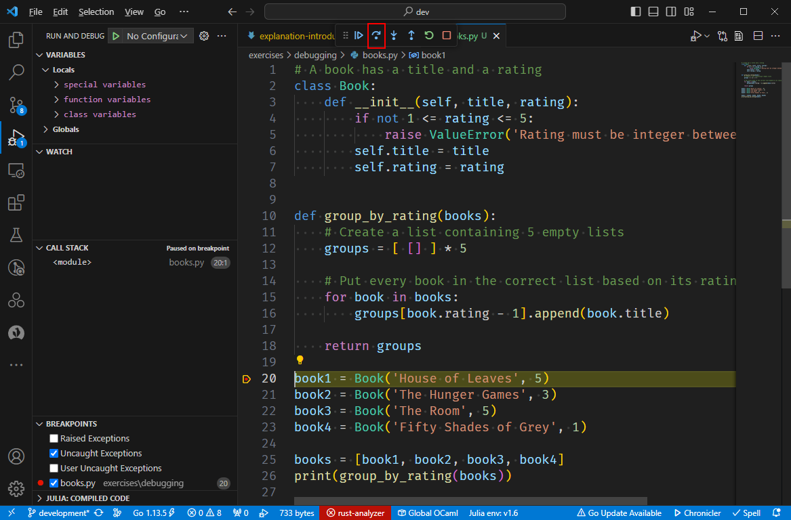

# Breakpoints

We could run the script in debug mode, but this will not yield new information: the script does not crash; it merely returns a wrong result.
At no point will the debugger become active.

However, we can add a *breakpoint*.

::::TASK
Add a breakpoint by clicking in the margin of the line containing the initialization of `book1`.
A little red dot should then appear at that spot.

:::center
|  |
:::
::::

Adding a breakpoint tells the debugger you'd like it to interrupt the execution of your script once it gets there.

::::TASK
Run the script in debug mode.
::::

As of yet, nothing remarkable has happened.
The debugger highlights the line that is next to be executed, which in our case is the one initializing `book1`.

::::TASK
Press the "Step Over" button to execute the next line.
You can see its name by hovering over the button until the tooltip appears.

:::center

:::
::::

In the left pane, an extra variable `book1` has appeared.
You can check that its fields are initialized to the expected values.

::::TASK
Press the "Step Over" button four more times so that the next line to be executed is the one containing the call to `group_by_rating`.
::::

The tab on the left now contains entries for `book1`, `book2`, `book3`, `book4` and `books`.
As of yet, everything looks fine.

::::TASK
Execution is paused on the line calling `group_by_rating`.
Press the Step Over button once more.
::::

Oops.
The debugger executed the line as one single step.
The incorrect output is written to the screen, and since this was the last line in our script, the program has terminated and the debugging session also ends.
What we want is to see what's happening inside the `group_by_rating` function.

::::TASK
Restart the debugger.
Press Step Over five times so that execution reaches the call to `group_by_rating` once more.

Now, press the **Step Into** button which is located just to the right of the Step Over button.
::::

Execution will now have jumped to `groups = [ [] ] * 5` inside the `group_by_rating` function.

::::TASK
Press Step Over.
::::

We see the `groups` variable appear in the left pane.
Nothing suspicious.
Let's move on.

::::TASK
Press Step Over to start the loop.
Press Step Over one more time to append the first book to a list.
::::

Uh oh.
In the left pane, we can see the `'House of Leaves'` has been added to all five lists instead of just one.
We have seen the bug in action!

The line `groups[book.rating - 1].append(book.title)` contains a single `append` method call.
How can it be that it has seemingly performed five appends at once?
You should trust `append` since it is part of Python's standard library and has already been billions of times before.
If it were buggy, surely someone would have noticed already.
Let's see what happens if we append another element manually.

::::TASK
Go to the Debug Console: in the menu, pick View and choose Debug Console.

Enter `groups[0]`.
It should respond with `['House of Leaves']`.

Now enter `groups[0].append('test')`.
::::

You can see in the left pane that `test` has again been added to all five lists.
Interesting.
Let's see what happens if we add another item to another list.

::::TASK
In the Debugging Console, enter `groups[1].append('test2')`.
::::

This also has the effect of adding the item to all lists.
Let's do one final test.

::::TASK
In the Debugging Console, enter `groups[2].clear()`.
::::

::::INFO
`lst.clear()` [empties](https://docs.python.org/3/tutorial/datastructures.html) the list `lst`.
::::

All lists are emptied.
There's definitely a pattern here.

At this point, it looks like the debugger cannot help us much further.
Given all these "symptoms", we now have to form a hypothesis of what could be going wrong and test it.
Think for a while about what could be the reason for this odd behavior.

The reason that all lists are affected by each operation is because they're actually all the same list in memory.
Let's dissect `groups = [ [] ] * 5`.

* `[]` creates a *new* empty list in memory.
* `[ [] ]` creates a *new* empty list in memory.
  Then, it creates a second list and populates it with a *reference* to the empty list.
* `[ [] ] * 5` takes that one references and puts five copies of this *reference* in a list.
  It is important to realize that all these five references point to the same empty list.

::::EXAMPLE
For those confused: imagine you have a list of children containing the name of the same child five times over.
You take the first name on the list and you give that child a piece of candy.
You then ask the child whose name appears last on the list and ask them if they received candy.
They will of course answer yes.
::::

To test our hypothesis, we can ask Python if the lists are indeed the same:

::::TASK
In the Debugger Console, enter `groups[0] is groups[1]`.
It will respond with `True`.

You can now stop the debugger.
::::

We have found our culprit: it is the line `groups = [ [] ] * 5`.

::::TASK
Replace this line by code that puts five *distinct* empty lists in `groups`.

Run the script in normal mode
It should not output the correct result.
::::
