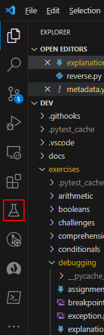

# Debugging Tests

So far, we have been debugging standalone Python scripts by using the "Debug Python File" feature of Visual Studio Code.
However, using this approach on test files will not work: they are just a bunch of functions, there is no code that contains them.
This is why the tests are run using `pytest test-subject.py`: Pytest takes care of calling these test functions.

::::TASK
In order to run the tests in debug mode, open the Testing tab in Visual Studio's sidebar.

:::center

:::

* Press the Configure Python Tests button.
* Select pytest.
* Select the exercises directory.
::::

Now the Testing tab will contain a list of tests.
You can run them from there in either normal or debug mode.
