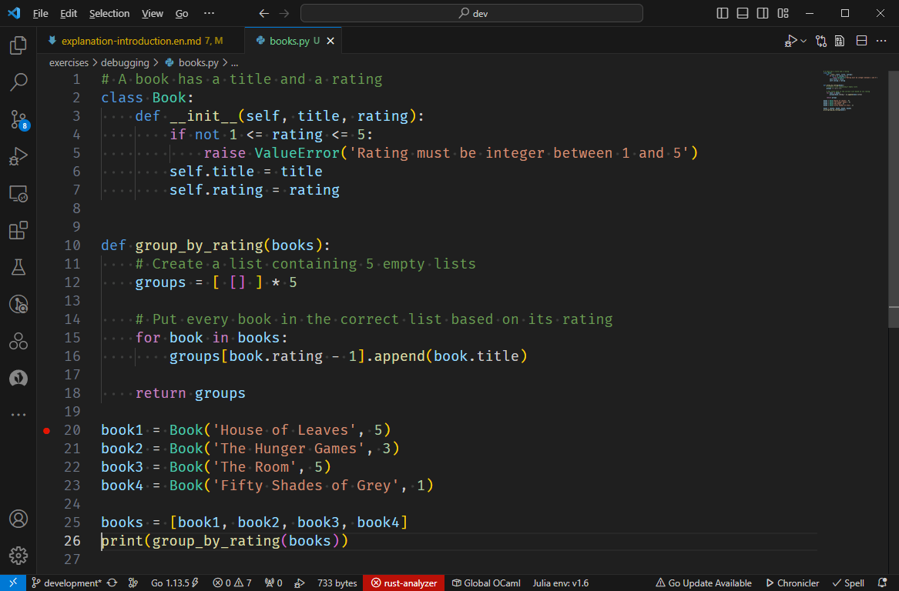
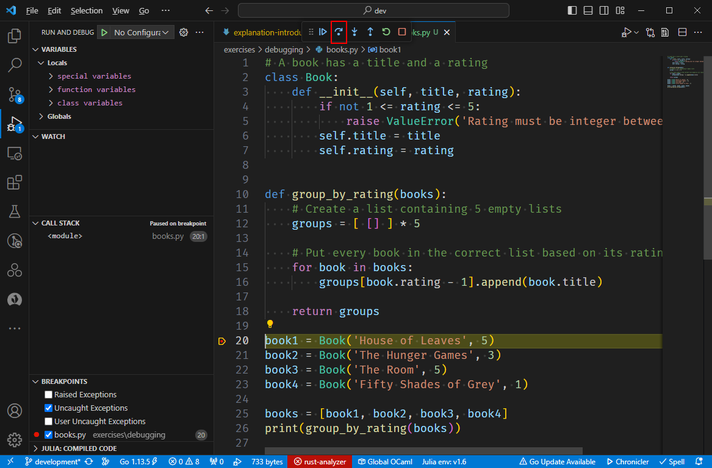

# Debugging

Examine the code below.

:::code{caption="Python"}

```python
# A book has a title and a rating
class Book:
    def __init__(self, title, rating):
        if not 1 <= rating <= 5:
            raise ValueError('Rating must be integer between 1 and 5')
        self.title = title
        self.rating = rating


def group_by_rating(books):
    # Create a list containing 5 empty lists
    groups = [ [] ] * 5

    # Put every book in the correct list based on its rating
    for book in books:
        groups[book.rating].append(book.title)

    return groups
```

:::

Say we use this code as follows:

:::code{caption="Python Shell"}

```python
>>> book1 = Book('House of Leaves', 5)
>>> book2 = Book('The Hunger Games', 3)
>>> book3 = Book('The Room', 5)
>>> book4 = Book('Fifty Shades of Grey', 1)

>>> books = [book1, book2, book3, book4]
>>> group_by_rating(books)
# Expected output
[
    ['Fifty Shades of Grey'],
    [],
    ['The Hunger Games'],
    [],
    ['House of Leaves', 'The Room']
]
```

:::

::::TASK

Copy all code above (class definition, `group_by_rating` and the test code) to a file `books.py`.
Make sure `group_by_rating`'s output is actually `print`ed out to the screen.
Run the code from the shell:

:::code{caption="Shell"}

```bash
$ py books.py
```

:::

::::

You will be greeted by an `IndexError`.
Think for a moment what could be the cause.
You might spot the mistake quickly, or it might not be so obvious.

While it is possible to keep staring at the code looking for the bug, this is often an inefficient use of your time (especially during exams).
A better approach exists: a tool, known as a *debugger*_*, allows you to execute code step by step.
This allows you to see how the variables' values change as the program is running, making it much easier to identify the bug(s).

## Starting the Debugger

Let's start the debugger.

::::TASK
To start the debugger in Visual Studio Code, first open the file to debug, in our case `books.py`.
Next, in the upper right corner, look for the play button and press the down arrow to the right of it and pick "Debug Python File" in the menu that opened:

:::center

:::

This will cause the script to run in debug mode.
::::

As we have discovered before, there is a bug that leads to an `IndexError`.
In normal circumstances, this immediately stops the script.
However, in debug mode, the debugger takes over and shows you the following information:

:::center

:::

Notice the following details:

1. The line causing the error is highlighted in the source code.
2. The popup indicates which part of the line failed.
3. The file and line are mentioned.
4. In the left pane, you are shown an overview of the variables with their values.

From this, we learn that the indexing `groups[book.rating]` failed.
In the left tab, we can see that `book.rating` equals `5`, while `groups` is equal to `[[], [], [], [], []]`.

As you remember, the first item in a list has index `0`, meaning that the last item in `groups` has index `4`.
In other words, there is no item with index `5`, causing the `IndexError` to be raised.

We can fix this in one of two ways:

* Since a rating ranges from 1 to 5, we can replace `groups[book.rating]` by `groups[book.rating-1]`.
* We can make `groups` one longer by replacing `[ [] ] * 5` by `[ [] ] * 6`.

Let's go for the first solution as it ought to waste slightly less memory.

::::TASK
First, end the debugging session by pressing the stop button at the top (5 in the screenshot shown above).
Next, fix the code and run the script again.

:::code{caption="Shell"}

```bash
$ py books.py
[['House of Leaves', 'The Hunger Games', 'The Room', 'Fifty Shades of Grey'], ['House of Leaves', 'The Hunger Games', 'The Room', 'Fifty Shades of Grey'], ['House of Leaves', 'The Hunger Games', 'The Room', 'Fifty Shades of Grey'], ['House of Leaves', 'The Hunger Games', 'The Room', 'Fifty Shades of Grey'], ['House of Leaves', 'The Hunger Games', 'The Room', 'Fifty Shades of Grey']]
```

:::
::::

Each of the five lists contains all the books.
This is definitely not what we expected to see.

## Breakpoint

We could run the script in debug mode, but this will not yield new information: the script does not crash; it merely returns a wrong result.
At no point will the debugger become active.

However, we can add a *breakpoint*.

::::TASK
Add a breakpoint by clicking in the margin of the line containing the initialization of `book1`.
A little red dot should then appear at that spot.

:::center
|  |
:::
::::

Adding a breakpoint tells the debugger you'd like it to interrupt the execution of your script once it gets there.

::::TASK
Run the script in debug mode.
::::

As of yet, nothing remarkable has happened.
The debugger highlights the line that is next in line to be executed, which in our case is the one initializing `book1`.

::::TASK
Press the "Step Over" button to execute the next line.

:::center

:::
::::

In the left pane, an extra variable `book1` has appeared.
You can check that its fields are initialized to the expected values.

::::TASK
Press the "Step Over" button four more times so that the next line to be executed is the one containing the call to `group_by_rating`.
::::

The tab on the left now contains entries for all four `bookN` variables and `books`.
As of yet, everything looks fine.

* While using, predict first and check after