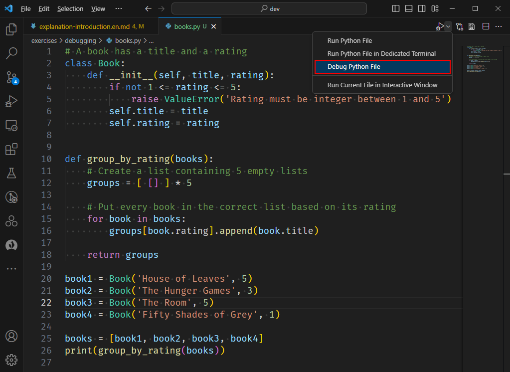
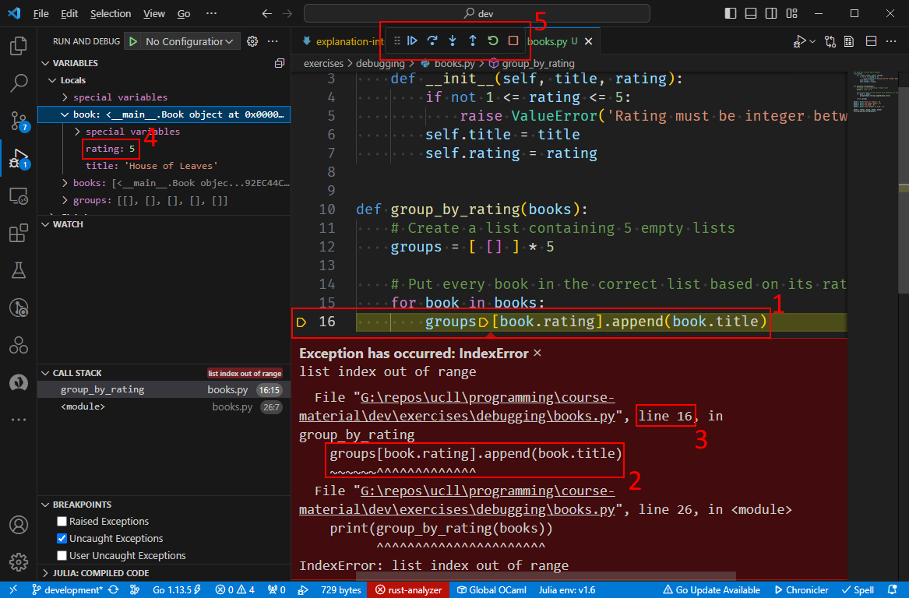

# Starting the Debugger

Let's start the debugger.

::::TASK
To start the debugger in Visual Studio Code, first open the file to debug, in our case `books.py`.
Next, in the upper right corner, look for the play button and press the down arrow to the right of it and pick "Debug Python File" in the menu that opened:

:::center

:::

This will cause the script to run in debug mode.
::::

As we have discovered before, there is a bug that leads to an `IndexError`.
In normal circumstances, this immediately stops the script.
However, in debug mode, the debugger takes over and shows you the following information:

:::center

:::

Notice the following details:

1. The line causing the error is highlighted in the source code.
2. The popup indicates which part of the line failed.
3. The file and line are mentioned.
4. In the left pane, you are shown an overview of the variables with their values.

From this, we learn that the indexing `groups[book.rating]` failed.
In the left tab, we can see that `book.rating` equals `5`, while `groups` is equal to `[[], [], [], [], []]`.

As you remember, the first item in a list has index `0`, meaning that the last item in `groups` has index `4`.
In other words, there is no item with index `5`, causing the `IndexError` to be raised.

We can fix this in one of two ways:

* Since a rating ranges from 1 to 5, we can replace `groups[book.rating]` by `groups[book.rating-1]`.
* We can make `groups` one longer by replacing `[ [] ] * 5` by `[ [] ] * 6`.

Let's go for the first solution as it ought to waste slightly less memory.

::::TASK
First, end the debugging session by pressing the stop button at the top (5 in the screenshot shown above).
Next, fix the code and run the script again.

:::code{caption="Shell"}

```bash
$ py books.py
[['House of Leaves', 'The Hunger Games', 'The Room', 'Fifty Shades of Grey'], ['House of Leaves', 'The Hunger Games', 'The Room', 'Fifty Shades of Grey'], ['House of Leaves', 'The Hunger Games', 'The Room', 'Fifty Shades of Grey'], ['House of Leaves', 'The Hunger Games', 'The Room', 'Fifty Shades of Grey'], ['House of Leaves', 'The Hunger Games', 'The Room', 'Fifty Shades of Grey']]
```

:::
::::

Each of the five lists contains all the books.
This is definitely not what we expected to see.
We still have some more debugging to do.
