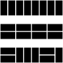

# Tilings

You need to tile long narrow rectangle area with width `width` and height 2.
Your tiles are rectangular with dimensions 2 by 1.
We can only place the tilings horizontally or vertically.
How many ways are there to tile this area?

::::EXAMPLE
Say the area is 8 wide.
Below are a three possible tilings:

:::center

:::
::::

::::TASK
Write a function `tilings(width)` that returns the number of possible tilings.
::::

::::HINT{caption="Hint 1"}
Imagine tiling the area from left to right.
How can you place the first tile?
There are only two options.

After you place the first tile, ask yourself how much area is left to cover.
Rely on recursion to determine how many possibilities there are for this remaining area.
::::

::::HINT{caption="Hint 2"}
Given an area with width `width`.
We start at the left.

* A first option is to place the first tile vertically.
  We then have an area `width - 1` left to cover.
* A second option is to place a first tile horizontally in the top left corner.
  This forces to also put the next tile horizontally directly below it.
  Now there's an area `width - 2` left to cover.

Taking the sum yields the total number of possible tilings.
::::
