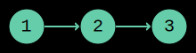

# Linked Lists

We have discussed tuples and lists as ways of representing ordered sequences of values.
Internally, these are blocks of contiguous memory: all items are placed one after the other in RAM.

## Insertion in Front

Say we insert a new item at the beginning of a list:

:::code{caption="Python Shell"}

```python
>>> ns = [1, 2, 3]
>>> ns.insert(0, 0)
>>> ns
[0, 1, 2, 3]
```

:::

What happens internally is that all elements have to be shifted one position to the right:

:::code{caption="Python"}

```python
for i in range(len(ns), 0, -1):
    ns[i] = ns[i-1]

ns[0] = 0
```

:::

This can get quite slow if the lists contains many elements.
This is due inherently to the way the lists are represented internally.

## Alternative Representation

We can change how lists are represented internally.
Consider the following code:

:::code{caption="Python"}

```python
class Node:
    def __init__(self, value, next):
        self.value = value
        self.next = next
```

:::

A `Node` is an object with two fields:

* `value` contains an element of the list.
* `next` refers to the next node in the list.

Using these `Nodes`, we can build the list `[1, 2, 3]` as a chain of `Node`s:

:::code{caption="Python Shell"}

```python
>>> ns = Node(1, Node(2, Node(3, None)))
>>> ns.value
1

>>> ns.next.value
2

>>> ns.next.next.value
3
```

:::

A visualization might help:

:::center

:::

A chain of objects representing a list is called a *linked list*.
One of the advantages of linked lists is that insertion in front is very cheap:

:::code{caption="Python"}

```python
# Adding 0 in front
>>> ns = Node(0, ns)
```

:::

As you can see, adding a new item in front is merely a matter of creating a new `Node`.
No values need to be moved around.

::::INFO
Linked lists are certainly not strictly better than lists: they can be fast where regular lists are slow, but they can also be slow where regular lists are fast.

The reason we introduce them is that they are great to practice recursion on.
::::
